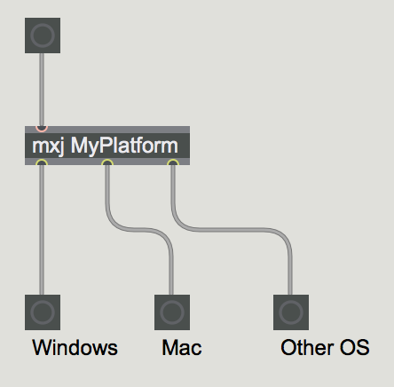

# Max/MSPでOSの判定をするmxjプロジェクトです

## ビルド方法
Macの場合（Windowsは適宜読み替えて下さい）
``` sh
cd mxj
make MAX_JAR=/Applications/Max.app/Contents/Resources/C74/packages/max-mxj/java-classes/lib/max.jar
```

MAX_JARはご自身の環境の`max.jar`が存在するパスを指定して下さい。
上記はMax7での実行です。

## 使い方


MyPlatform配下がサンプルになります。
